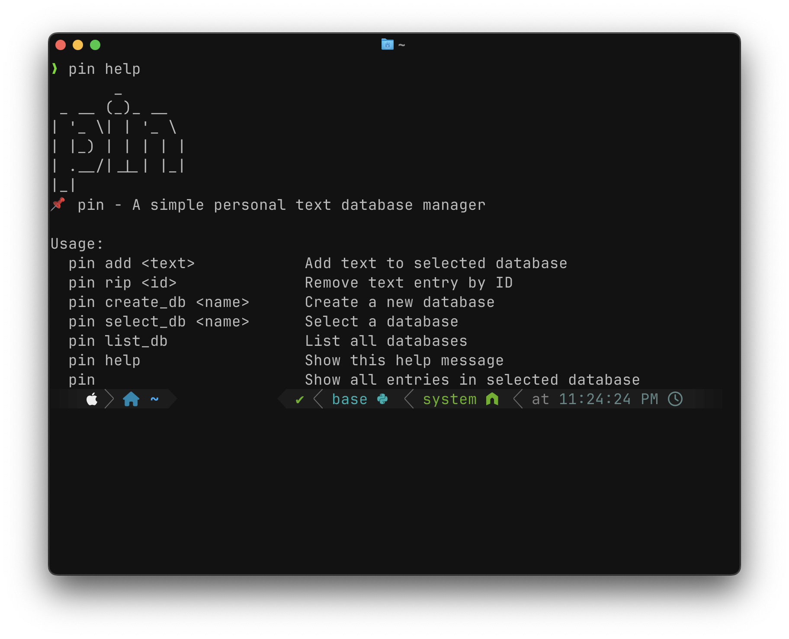

# pin

A tiny, personal text database manager written as a single Bash script. Store short notes/snippets in simple JSON “databases” under your home directory and manage them with a small set of commands.

<p align="center">
  
  <br>
  <em>pin showing entries in the selected database</em>
</p>

- Default storage: ~/.config/pin/database/
- Default database name: pin_default (auto-created on first run)

## Features

- Add short text entries and get an auto-incremented ID back
- List entries in the currently selected database with colors and counts
- Remove (rip) an entry by ID
- Create multiple databases and switch between them
- Lightweight JSON storage using jq

## Requirements

- Bash (tested on macOS)
- jq (JSON processor)
- figlet (optional; used only for the help banner)

Install on macOS using Homebrew:

```
brew install jq figlet
```

Install on Debian/Ubuntu:

```
sudo apt-get update
sudo apt-get install -y jq figlet
```

## Installation

1) Make the script executable:

```
chmod +x pin.sh
```

2) Put it on your PATH (pick one):

- System-wide (may require sudo):

```
sudo cp pin.sh /usr/local/bin/pin
```

- User-local:

```
mkdir -p "$HOME/bin"
cp pin.sh "$HOME/bin/pin"
chmod +x "$HOME/bin/pin"
# Ensure $HOME/bin is on your PATH (e.g., add to ~/.zshrc or ~/.bashrc):
# export PATH="$HOME/bin:$PATH"
```

3) Verify:

```
pin help
```

On first run, pin will create the directory ~/.config/pin/, initialize the default database at ~/.config/pin/database/pin_default.json, and store the selected DB name in ~/.config/pin/config.

## Usage

General form:

```
pin <command> [arguments]
```

Commands:

- pin
  Show all entries in the currently selected database.

- pin add <text>
  Add a text entry to the selected database. Returns the new entry ID.

- pin rip <id>
  Remove a text entry by numeric ID.

- pin create_db <name>
  Create a new database with the given name.

- pin select_db <name>
  Select the database to operate on.

- pin list_db
  List all databases, indicating which one is selected and which is the default.

- pin help
  Show the help screen.

### Examples

Add entries:

```
pin add "Buy milk"
pin add "Idea: build a CLI pinboard"
```

List entries in the current DB:

```
pin
```

Remove an entry by ID:

```
pin rip 3
```

Create and switch databases:

```
pin create_db ideas
pin select_db ideas
pin add "Explore text embeddings for search"
```

See all databases:

```
pin list_db
```

Show help:

```
pin help
```

## Data layout

- Config directory: ~/.config/pin/
- Selected DB marker: ~/.config/pin/config
- Databases (JSON files): ~/.config/pin/database/<db_name>.json

Each database file is a JSON array of objects with shape:

```
[
  { "id": 1, "text": "..." },
  { "id": 2, "text": "..." }
]
```

IDs are assigned by taking the current maximum id and adding 1.

## Notes and tips

- Quotes in text: If your text contains double quotes, prefer quoting the shell argument with single quotes to avoid escaping issues, e.g.:

```
pin add 'He said "hello" and left.'
```

- figlet is optional: If figlet isn’t installed, only the fancy banner in pin help will be missing; other commands work fine.

- Portability: The script uses mktemp, sort, tail, and jq which are commonly available on Unix-like systems. Tested primarily on macOS.

## Troubleshooting

- “command not found: pin”
  Ensure the script is on your PATH and is executable (chmod +x). Print your PATH or re-source your shell rc file.

- “jq: command not found”
  Install jq (see Requirements).

- No output when listing
  Ensure the selected database file exists at ~/.config/pin/database/<name>.json and contains valid JSON. pin creates an empty array [] for new DBs automatically.

## Development

- Script entry point: pin.sh
- Colors and formatting: ANSI color codes are used for nicer output.
- Dependencies: jq for JSON manipulation; figlet for the optional help banner.

## License

MIT

## Acknowledgements

- jq (https://stedolan.github.io/jq/)
- figlet (http://www.figlet.org/)

